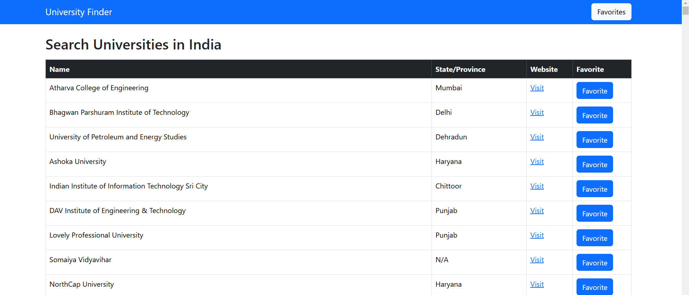
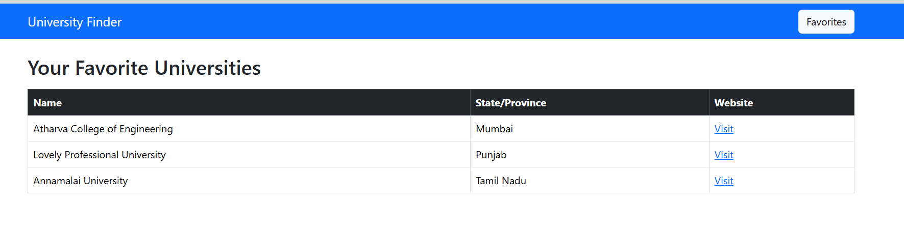

University Search App

📌 Project Overview

A full-stack web application that allows users to search for universities in India using an external API. Users can mark universities as favorites and store them in a database. The favorites list can be accessed without calling the external API.

🚀 Features

Search Universities: Fetch universities in India from an external API.

Display Results: Show university details in a table with clickable links.

Favorite Universities: Mark universities as favorites and save them to a database.

View Favorites: Display all saved universities without calling the API again.

🛠️ Tech Stack

Backend:

Node.js + Express.js (for API and server)

MySQL (for database storage)

Sequelize (for database ORM)

Frontend:

React.js (for UI)

Bootstrap 5 (for styling)

Other Tools:

Git (for version control)

📂 Project Structure

/university-search-app
│── backend/            # Node.js & Express server
│   ├── src/
│       ├── routes/         # API endpoints
│       ├── models/         # Database models
│       ├── controllers/    # Business logic
│       ├── config/        # Database connection setup
│   ├── index.js        # Entry point
│
│── frontend/           # React app
│   ├── src/
│   │   ├── components/ # UI components
│   │   ├── pages/      # Search & Favorites pages
│   │   ├── App.js      # Main component
│   │   ├── index.js    # React entry point
│
│── README.md           # Documentation
│── .gitignore          # Git ignored files

📖 API Endpoints

External API:

GET https://university-domains-list-api.herokuapp.com/search?country=India → Fetch universities in India

Backend API:

GET /api/universities → Fetch universities from external API

POST /api/favourites → Save a university to favorites

GET /api/favourites → Get all saved favorites

🔧 Setup Instructions

Prerequisites:

Node.js & npm installed

MySQL database set up

Backend Setup:

cd backend
npm install
npm start

Frontend Setup:

cd frontend
npm install
npm start

Database Setup:

Create a MySQL database.

Update the .env file with database credentials.

Run migrations using Sequelize:

npx sequelize-cli db:migrate

📷 Screenshots

Search Page

Favorites Page

